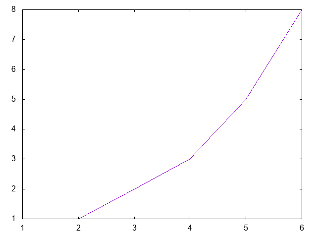
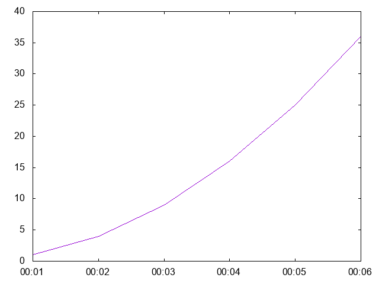

# gnuplot

Lua gnuplot interface.

# Requirements:

* gnuplot; and
* Lua 5.1 or later.

# Reference

## gnuplot.execute(commands)

Executes each command in `commands` list. If an element is a list of records ({{x, ...}, ...}), it will be executed as gnuplot inline data followed by `e`.

## gnuplot.plot2d(outputFileName, data)

Plots `data` ({{x, y}, ...}) to a png image file with `outputFileName` name.

## gnuplot.plot2dTimeSeries(outputFileName, data, [timeFormat])

Plots `data` ({{x, y}, ...}) where 'x' is a time string with `timeFormat` to a png image file with `outputFileName` name. The default value for `timeFormat` is `%Y%m%dT%H%M%S`.

# Example

```lua
package.path = package.path .. ';../?.lua'
local gnuplot = require'gnuplot'

local data = {
    {1, 1},
    {2, 1},
    {3, 2},
    {4, 3},
    {5, 5},
    {6, 8}
}
gnuplot.plot2d('2d.png', data)

local timeSeries = {
    {'20200502T000001', 1},
    {'20200502T000002', 4},
    {'20200502T000003', 9},
    {'20200502T000004', 16},
    {'20200502T000005', 25},
    {'20200502T000006', 36}
}

gnuplot.plot2dTimeSeries('2dTimeSeries.png', timeSeries)
```




